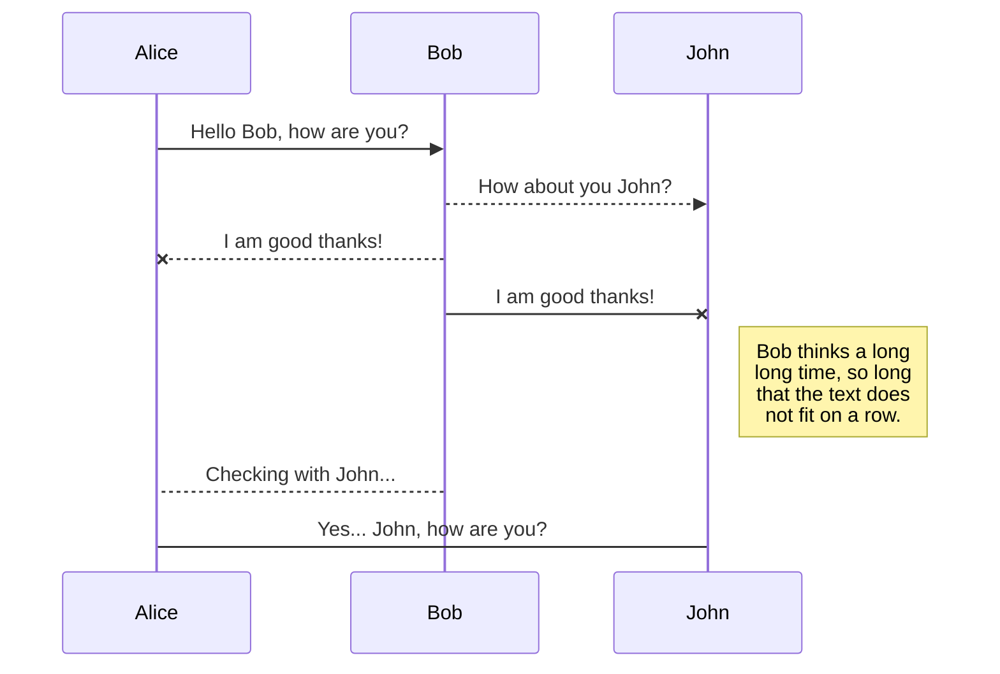
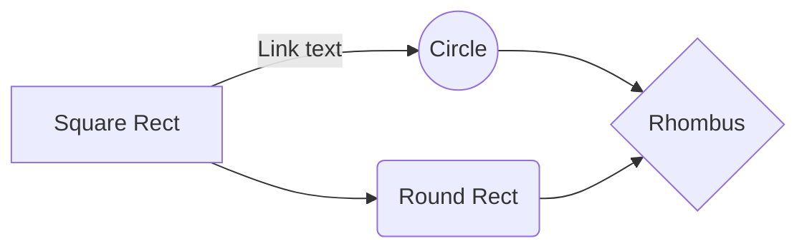

# Nordic Blockchain
A blockchain based transaction manager for transaction proofing that require reliability and multi-sided confirmation.
Designed with the intent of not storing the asset value itself but the metadata of such asset with subsequent confirmation delegated to the bank's systems.

# Compile & Run
Nordic Blockchain uses .NET Core, as far as the building environment comprises .NET Core and NuGet Package Management software chain the project is compilable in an easy way.

### Dependencies
* [Newtonsoft JSON](https://www.newtonsoft.com/json) 
* [Peer2Net](https://github.com/lontivero/peer2net)

### Compile procedure
1. Compile "NordicBlockchain"
2. Compile "NBService"

### Run
Run dotnet on NBService.dll or your custom service application.
Can be installed on a linux server as service by running 

    sudo ./install_as_service.sh > /dev/null && sudo service nordicblockchain start
    sudo ./master_as_service.sh > /dev/null && sudo service nbmaster start

## Service definition

Multiple parts of the service exist for different purposes.

| Project Name   |Tipology                       |Definition                   |
|----------------|-------------------------------|-----------------------------|
|NordicBlockchain|`Library [REQUIRED]`           |Core NB code and mechanics.  |
|NBService       |`Main Service [REQUIRED]`      |Actual blockchain node service. |
|NBMaster        |`Cache Service [REQUIRED]`     |Global service for P2P Broadcasting|
|NBCryptoManager |`Internal Tool`                |Cryptographic tool for key generations|

## UML diagrams test

And this will produce a flow chart:

